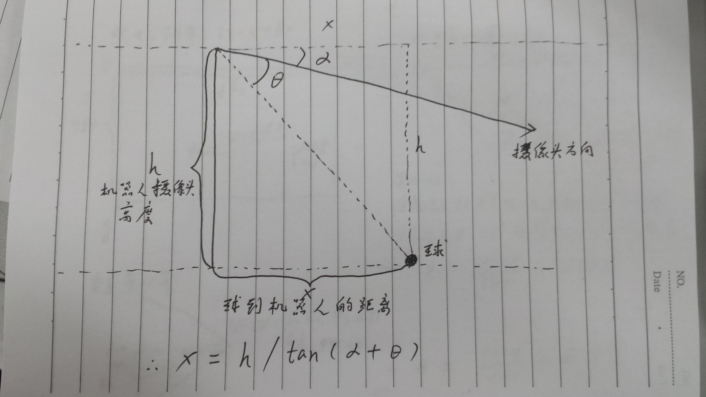
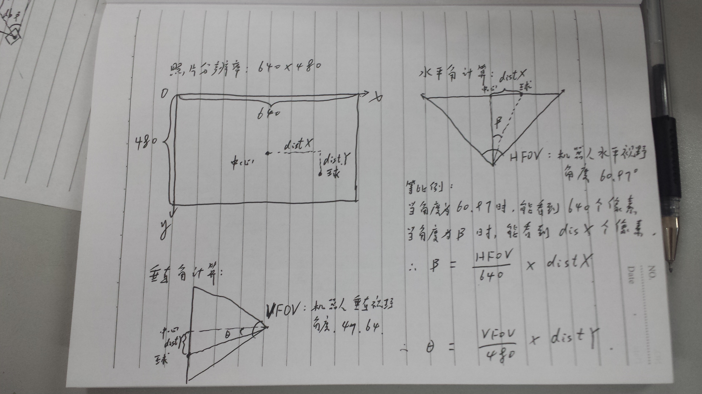
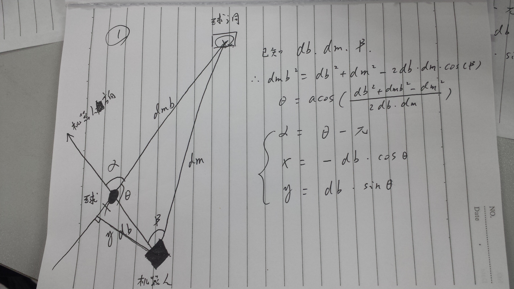
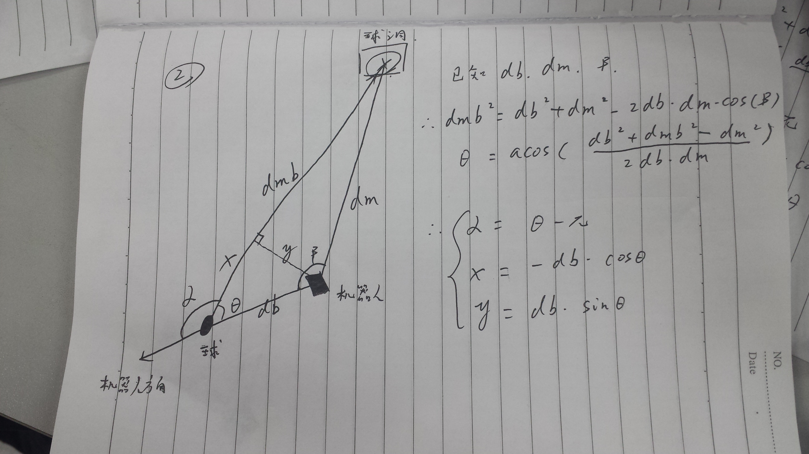
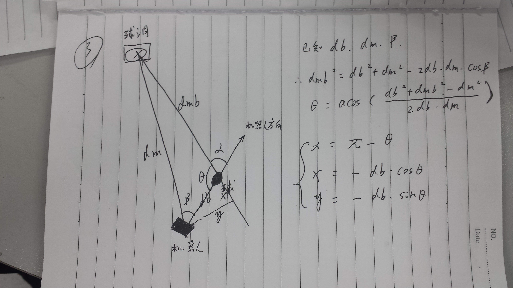
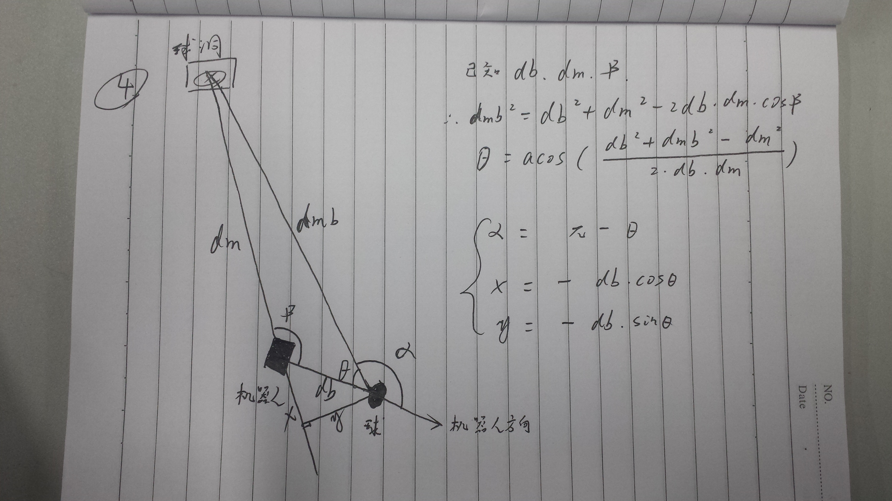

### 机器人单目测距原理：

#### 1、球到机器人的距离计算：

  

机器人的摄像头与水平方向是有一定的偏转角度的。上方摄像头为1.2°，下方摄像头为39.7°  
现假设摄像头与水平方向偏转角度为α  
球到机器人的距离由公式可以算出：
x = h / tan(α + θ)  
所以我们求出球与摄像头方向的垂直偏转角度θ就行了

#### 2、 球与摄像头方向的垂直偏转角和水平偏转角计算：

  

机器人拍摄的照片假设分辨率为640*480，也就是说水平方向有640个像素点，垂直方向有480个像素点。  
水平角的计算：  
HFOV:机器人摄像头水平视角，实际为60.97°  
distX：球在照片中的成像离照片中心的水平距离（像素点）  
因为当视角为HFOV的时候可以看到640个像素点，所以当角度为β的时候就应该有distX个像素点  
所以根据等比例法水平角就可以由公式计算出：  
β = HFOV /640 * distX  
垂直角的计算：  
θ = VFOV / 480 * distY

**补充：** 求机器人和球的实际距离时还需要考虑水平偏转角，所以实际求距离的公式应该为：  
x = (h / tan(α + θ)) / cos(β)

#### 3、 机器人移动到机器人、球和球洞三点一线的位置计算：
##### 机器人脚部中心作为坐标系原点，旋转逆时针为正；前后移动作为x轴，向前为正；左右移动作为y轴，向左为正。一共分四种情况，其实就是余弦定理解三角函数。

